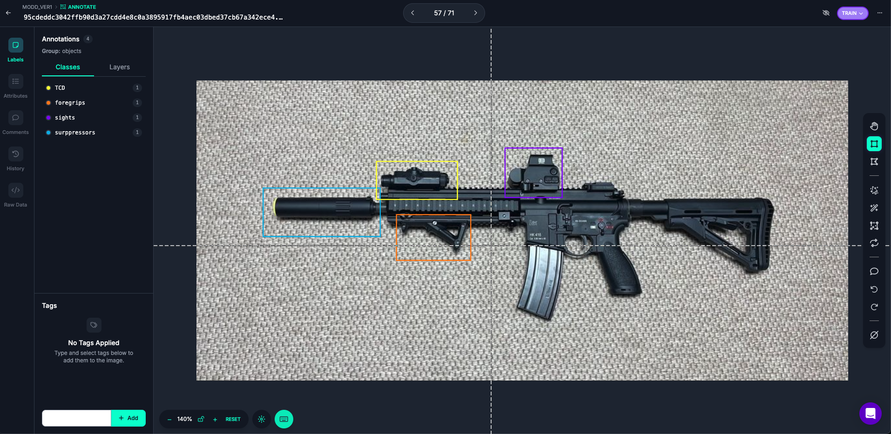
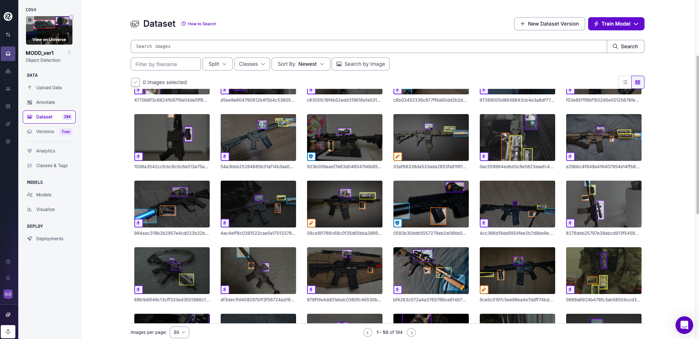
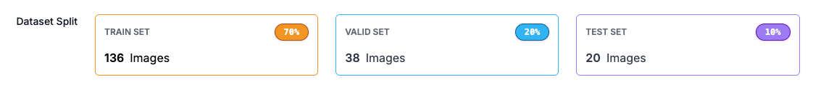
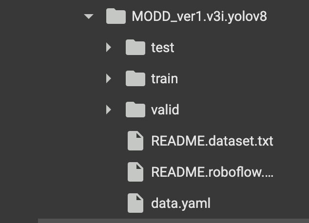
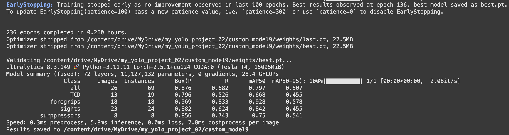
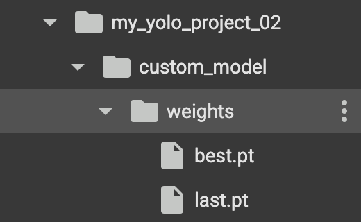
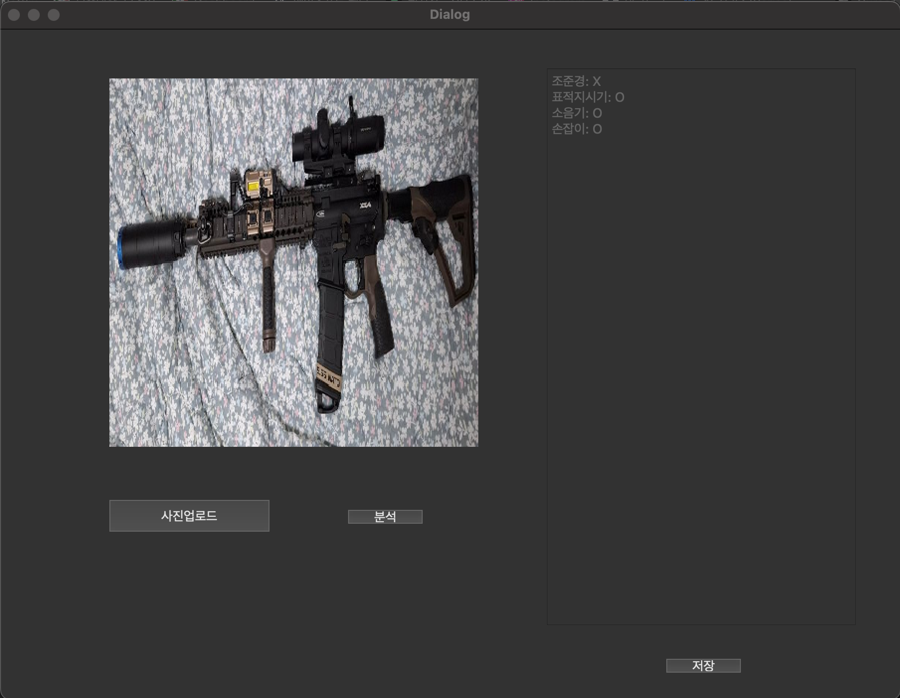
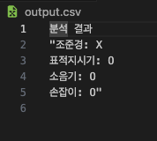

# MODD_ver1
## 시작하기 앞서 사용된 모든 이미지는 에어소프트건임을 미리 알립니다.
## 목표
### 우송대학교 2025 취업연계형 수업에서 배운 yolov8을 활용하는 기술을 전반적으로 복습
## 최종 기술 스택
### - 총기의 종류(ex. hk416), 부착물 종류 구분(ex. magpul afg-2)
### - html을 이용해 웹에서 사용가능하도록 하기
### - 가능하다면 확장프로그램으로 사용가능하도록 하기
## ver1 기술 스택
### - 총기 부착물 유무 판별
#### o 혼자서 데이터를 모으는데 한계가 있음
#### o 에어소프트건(이하 총기) 사진자체가 수가 적음
## 1. Roboflow 
### yolov8 모델을 활용하기 위해 사용
#### - 라벨링 특화
### 1.1 roboflow에 수집한 이미지 데이터들을 업로드 및 식별할 개체에 라벨링 박스를 달아줍니다. (약 200장)

### 1.2 학습을 위해 데이터의 train, valid, test를 70, 20, 10으로 설정합니다.

## 2. Colab
### yolo 모델을 학습시키기위한 gpu를 클라우드 형태로 제공
### 2.1 구글 클라우드에 roboflow에서 다운받은 데이터를 업로드, colab에 drive 마운트

### 2.2 yolov8 학습을 위한 코드 작성
<pre>
  <code>
    from ultralytics import YOLO
    def main():
        model = YOLO("yolov8s.pt")
    
        model.train(
            data="/content/drive/MyDrive/MODD_ver1.v3i.yolov8/data.yaml",
            epochs=300,
            imgsz=640,
            project="/content/drive/MyDrive/my_yolo_project_02",  # 저장될 상위 폴더
            name="custom_model",                                  # 이 이름 하위 폴더가 생성됨
        )
    if __name__ == "__main__":
        main()

  </code>
</pre>

### 2.3 colab 학습 결과

### mAP50-95 결과 확인
#### TCD 0.455 / foregrips 0.578 / sights 0.455 / surppressors 0.541
#### 생성된 결과물 파일

## 3. python
### 3.1 필요한 라이브러리 불러오기
<pre>
  <code>
    from PyQt6 import uic
    from PyQt6.QtWidgets import QApplication, QFileDialog, QLabel, QPushButton, QTextEdit, QTextBrowser
    from PyQt6.QtGui import QPixmap
    from ultralytics import YOLO 
    import torch
    import csv
    import sys
  </code>
</pre>
### 3.2 pyqt를 이용해 만들어둔 ui 창 불러오기
<pre>
  <code>
    Form, Window = uic.loadUiType("dev/ui/ModDetect.ui")
  </code>
</pre>
### 3.3 pyqt ui의 버튼의 기능 및 yolov8(best.pt)를 이용해 분석하는 기능 구현
<pre>
  <code>
    class MainApp:
    def __init__(self):
        self.app = QApplication([])
        self.window = Window()
        self.form = Form()
        self.form.setupUi(self.window)

        # 위젯 연결
        self.upload_btn: QPushButton = self.window.findChild(QPushButton, "upload")
        self.start_btn: QPushButton = self.window.findChild(QPushButton, "start")
        self.save_btn: QPushButton = self.window.findChild(QPushButton, "save")
        self.arm_pic: QLabel = self.window.findChild(QLabel, "armPic")
        self.output: QTextEdit = self.window.findChild(QTextBrowser, "output")

        self.upload_btn.clicked.connect(self.upload_image)
        self.start_btn.clicked.connect(self.analyze_image)
        self.save_btn.clicked.connect(self.save_result)

        self.img_path = None
        self.result_text = ""
        self.model = YOLO("dev/best_02/best.pt")  # 모델 로드, 경로는 실제 모델 파일 위치에 맞게 조정

    def upload_image(self):
        file_dialog = QFileDialog()
        file_path, _ = file_dialog.getOpenFileName(self.window, "이미지 업로드", "", "Images (*.png *.jpg *.jpeg)")
        if file_path:
            self.img_path = file_path
            pixmap = QPixmap(file_path)
            self.arm_pic.setPixmap(pixmap.scaled(self.arm_pic.size()))
            self.output.setText("이미지 업로드 완료.")

    def analyze_image(self):
        if not self.img_path:
            self.output.setText("이미지를 먼저 업로드하세요.")
            return
        results = self.model(self.img_path)
        result = results[0]
        df = result.to_df()

        # 영어 클래스명과 한글명 매핑
        class_map = {
            "sight": "조준경",
            "TCD": "표적지시기",
            "surppressors": "소음기",
            "foregrips": "손잡이"
        }
        found = {v: False for v in class_map.values()}

        if "name" in df.columns:
            for eng, kor in class_map.items():
                if (df["name"] == eng).any():
                    found[kor] = True

        result_lines = []
        for kor in class_map.values():
            result_lines.append(f"{kor}: {'O' if found[kor] else 'X'}")
        self.result_text = "\n".join(result_lines)
        self.output.setText(self.result_text)

    def save_result(self):
        if not self.result_text:
            self.output.setText("분석 결과가 없습니다.")
            return
        # 결과를 줄 단위로 분리하여 csv로 저장
        with open("output.csv", "w", newline='', encoding='utf-8') as f:
            writer = csv.writer(f)
            writer.writerow(["항목", "유무"])
            for line in self.result_text.splitlines():
                if ": " in line:
                    item, value = line.split(": ")
                    writer.writerow([item, value])
        self.output.setText("결과가 저장되었습니다.")

    def save_result(self):
        if not self.result_text:
            self.output.setText("분석 결과가 없습니다.")
            return
        with open("output.csv", "w", newline='', encoding='utf-8') as f:
            writer = csv.writer(f)
            writer.writerow(["분석 결과"])
            writer.writerow([self.result_text])
        self.output.setText("결과가 저장되었습니다.")

    def run(self):
        self.window.show()
        sys.exit(self.app.exec())

    if __name__ == "__main__":
        MainApp().run()
  </code>
</pre>
## 4. 결과
###

## 5. 개선할 점
### 5.1 이미지 샘플 수를 보강해야 함
#### 현재 정확하게 구별하는데 어려움을 보임
### 5.2 ui 개선
#### - 이미지 미리보기를 이미지 크기에 따라 유동적으로 변하도록 변경
#### - 결과물에 유무만 띄우지 말고 감지한 개체에 라벨링 박스를 함께 넣어서 출력하도록 변경
